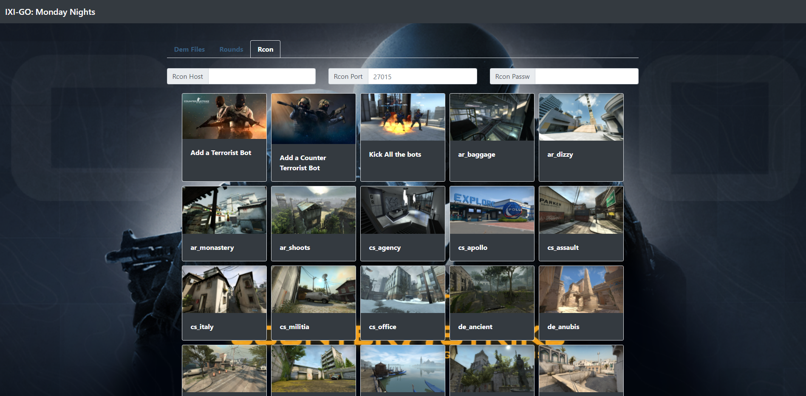

# CsGo Util

This is a personal project that I made to simplify couple of things when playing with my friends at CSGO. We play on our CSGO [dedicated server](https://github.com/marcosolina/csgo_server) and I wanted an easier way to issue RCON commands. I found [this nice library](https://github.com/Kronos666/rkon-core) which helps me to issue the commands that I need. I dedided then to create a simple REST API service and a simple PHP webpage to send RCON commands from the UI. In this way I just need to click on what I want to do :)

