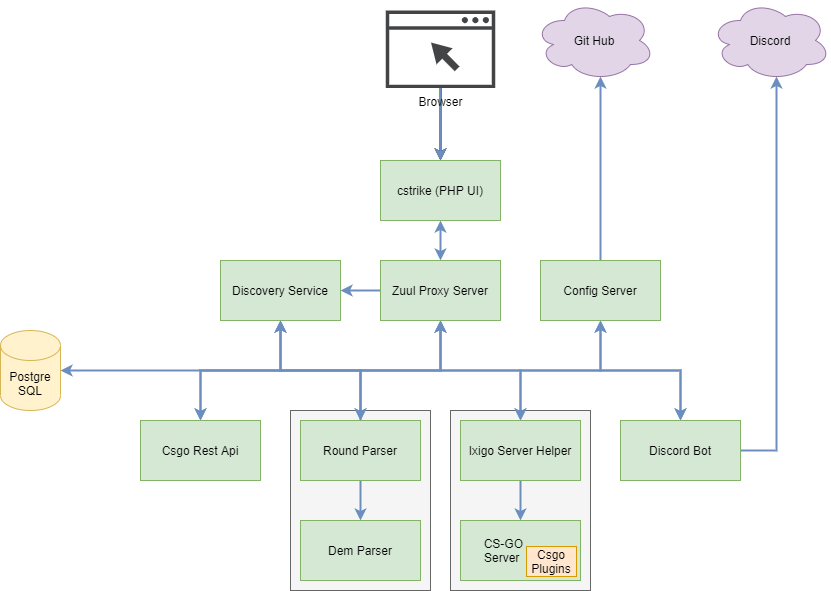

# IxiGo Util

This is a personal project that I made to simplify few things that I do when playing with my friends at CSGO. I have created a custom CSGO [dedicated server](https://github.com/marcosolina/ixi_go) that we use every week and we wanted to enhance our gaming experience with the automation of few tasks, like changing the map, add or remove bots, analyse our game performance and generate balanced teams based on our performance.

## Technologies Utilised

| | | |
|---|---|---|
| [Java](https://www.oracle.com/java/) | [Spring Boot](https://spring.io/projects/spring-boot) | [Spring Cloud](https://spring.io/projects/spring-cloud) |
| [Thymeleaf](https://www.thymeleaf.org/) | [HTML](https://en.wikipedia.org/wiki/HTML) | [Javascript](https://en.wikipedia.org/wiki/JavaScript) |
| [jQuery](https://jquery.com/) | [Bootstrap](https://getbootstrap.com/) | [Docker](https://www.docker.com/) |
| [PostgreSQL](https://www.postgresql.org/) |[JPA](https://en.wikipedia.org/wiki/Jakarta_Persistence) | [C#](https://en.wikipedia.org/wiki/C_Sharp_(programming_language)) |

## Requirements

- Java >= 8
- .NET Core
- PostgreSQL
- [IxiGo Dedicated Server](https://github.com/marcosolina/ixi_go)
- [Discord Bot Token](./IxigoDiscordBot/)
- [Steam Game Server Login Token](http://steamcommunity.com/dev/managegameservers)
- [Steam API Key](http://steamcommunity.com/dev/apikey)
- **Optional**:
  - Docker

## Project Structure

- csgo_util
  - **AppsProperties**: This folder contains the properties used by the different services in the different environments. These properties are retrieved using the "Ixigo Config Server"
  - [CsgoPlugins](./CsgoPlugins/): This folder contains the source code of the CSGO plugins that we use
  - [DemParser](./DemParser/): This folders contains the C# project that we use to parse the ".dem" files and extract the games stats
  - [IxigoConfigServer](./IxigoConfigServer/): This is the Spring Boot configuration service that is used to serve the Services Properties for the different environmnets
  - [IxigoDemManager](./IxigoDemManager): This Spring Boot service manages the "dem" files created by the CSGO server. For example it will store new files, use the DemParse app to process these files, expose REST API to retrieve the info or the files itself
  - [IxigoDiscordBot](./IxigoDiscordBot/): This Spring Boot service is used to automate some taks while we play on our CSGO dedicated server. For example it will listen for either CSGO events or messages in the chat and then it can move the players to the appropriate channel, retrieve the Players statistic to balance the teams. Type "!help" in the discord chat to see a full list of tasks that you can trigger
  - [IxigoDiscovery](./IxigoDiscovery/): This Spring Boot service is used to register all the services and simplify the S2S calls. It can be usefull for load balancing, either client side or server side load balancing
  - [IxigoEventDispatcher](./IxigoEventDispatcher/): This Spring Boot service receives the event fired by the Ixigo Server Helper and forwards these events to all the registered event listeners
  - [IxigoPlayersManager](./IxigoPlayersManager/): This Spring Boot service uses the players stats to perform some calculation. For example, this service is used to generate balanced CSGO teams when we play on our CSGO dedicated server
  - [IxigoProxy](./IxigoProxy/): This Spring Boot service is a proxy service that it is used to simplify the S2S calls. It is usesfull to perform the service side load balancing and to have a central point to call all the services. It can also help when you have CORS issues
  - [IxigoRconApiService](./IxigoRconApiService/): This Spring Boot service it is used to send RCON commands to our CSGO dedicated server via REST APIs
  - [IxigoServerHelper](./IxigoServerHelper/): This Spring Boot service is deployed on the same machine where the CSGO server is running. It monitors some CSGO files, fires events to the Ixigo Event Dispatcher and uploads the DEM files to the DEM manager service
  - [IxigoUi](./IxigoUi/): This Spring Boot Service it is used to provide a simple UI that can be used to perform some tasks when we play on our CSGO dedicate server. For example it can be used to quickly change the map, add / remove bot and balance the teams
  - **Misc**: Extra files used for example for the documentation or the UI (CSGO Font, logo, Screenshots etc...)
  - **Scripts**: This folder contains the scripts that I use to automate few things
    - **Docker**: Contains the scripts that I used to generate the required containers
    - **jenkins**: Contains the script/s that are used by Jenkins in the CI/CD pipeline

## Start With Docker Compose

The script it will use a [Docker Compose](https://docs.docker.com/compose/) yml file to create the network, images, containers and exposing the required ports. It will also create one container for the CSGO dedicated server. I will basically start all you need to run our CSGO server, plugins and micro services.

**Simply copy and paste the follwing command in your terminal and follow the instruction on the screen.**

~~~~bash
bash <(curl -L https://raw.githubusercontent.com/marcosolina/csgo_util/main/Scripts/Docker/setup.sh?$(date +%s))
~~~~

## Open API Documentation

Replace the IP with your machine/s IP/s

- [UI](http://MACHINE_IP:8089/ixigoui/)
- [Discovery](http://MACHINE_IP:8765/ixigodiscovery/)
- [Config](http://MACHINE_IP:8888/config/ixigo-server-helper/docker)
- [Proxy Routes](http://MACHINE_IP:8763/ixigoproxy/actuator/routes)
- [Open API Sepcs - Dem Manager](http://MACHINE_IP:8081/demmanager/swagger-ui.html)
- [Open API Sepcs - Players Manager](http://MACHINE_IP:8087/playersmanager/swagger-ui.html)
- [Open API Sepcs - RCON APIs](http://MACHINE_IP:8084/rcon/swagger-ui.html)
- [Open API Sepcs - Discord Bot](http://MACHINE_IP:8082/discordbot/swagger-ui.html)
- [Open API Sepcs - Event Dispatcher](http://MACHINE_IP:8086/eventsdispatcher/swagger-ui.html)

## Utils

~~~~bash
mvn archetype:generate -DgroupId=com.ixigo -DartifactId=IxigoPlayersManagerContract -DarchetypeArtifactId=maven-archetype-quickstart -DinteractiveMode=false
~~~~
