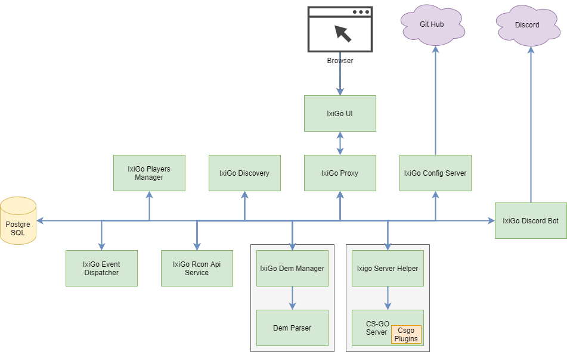

# IxiGo Util

This is a personal project that I made to simplify few things that I do when playing with my friends at CSGO. I have created a custom CSGO [dedicated server](https://github.com/marcosolina/ixi_go) that we use frequently and we wanted to enhance our gaming experience with the automation of few tasks, like changing the map, add or remove bots, analyse our game performance and generate balanced teams based on our performance.

## Project Structure

- csgo_util
  - **AppsProperties**: This folder contains the properties used by the different services in the different environments. These properties are retrieved using the "Ixigo Config Server"
  - [CsgoPlugins](./CsgoPlugins/): This folder contains the source code of the CSGO plugins that we use
  - [DemParser](./DemParser/): This folders contains the C# project that we use to parse the ".dem" files and extract the games stats
  - [IxigoConfigServer](./IxigoConfigServer/): This is the Spring Boot configuration service that is used to serve the Services Properties for the different environmnets
  - [IxigoDemManager](./IxigoDemManager): This Spring Boot service manages the "dem" files created by the CSGO server. For example it will store new files, use the DemParse app to process these files, expose REST API to retrieve the info or the files itself
  - [IxigoDiscordBot](./IxigoDiscordBot/): This Spring Boot service is used to automate some taks while we play on our CSGO dedicated server. For example it will listen for either CSGO events or messages in the chat and then it can move the players to the appropriate channel, retrieve the Players statistic to balance the teams. Type "!help" in the discord chat to see a full list of tasks that you can trigger
  - [IxigoDiscovery](./IxigoDiscovery/): This Spring Boot service is used to register all the services and simplify the S2S calls. It can be usefull for load balancing, either client side or server side load balancing
  - [IxigoEventDispatcher](./IxigoEventDispatcher/): This Spring Boot service receives the event fired by the Ixigo Server Helper and forwards these events to all the registered event listeners
  - [IxigoPlayersManager](./IxigoPlayersManager/): This Spring Boot service uses the players stats to perform some calculation. For example, this service is used to generate balanced CSGO teams when we play on our CSGO dedicated server
  - [IxigoProxy](./IxigoProxy/): This Spring Boot service is a proxy service that it is used to simplify the S2S calls. It is usesfull to perform the service side load balancing and to have a central point to call all the services. It can also help when you have CORS issues
  - [IxigoRconApiService](./IxigoRconApiService/): This Spring Boot service it is used to send RCON commands to our CSGO dedicated server via REST APIs
  - [IxigoServerHelper](./IxigoServerHelper/): This Spring Boot service is deployed on the same machine where the CSGO server is running. It monitors some CSGO files, fires events to the Ixigo Event Dispatcher and uploads the DEM files to the DEM manager service
  - [IxigoUi](./IxigoUi/): This Spring Boot Service it is used to provide a simple UI that can be used to perform some tasks when we play on our CSGO dedicate server. For example it can be used to quickly change the map, add / remove bot and balance the teams
  - **Misc**: Extra files used for example for the documentation or the UI (CSGO Font, logo, Screenshots etc...)
  - **Scripts**: This folder contains the scripts that I use to automate few things
    - **Docker**: Contains the scripts that I used to generate the required containers
    - **jenkins**: Contains the script/s that are used by Jenkins in the CI/CD pipeline

## Requirements

- Java >= 8
- .NET Core
- PostgreSQL
- **Optional**:
  - Docker

## Start With Docker Compose

~~~~bash
bash <(curl -L https://raw.githubusercontent.com/marcosolina/csgo_util/refactoring/Scripts/Docker/setup.sh?$(date +%s))
~~~~

## Register a CSGO Event Listener

The **Ixigo Event Dispatcher** service allows you to register you app and listen for some events which are fired by our CSGO dedicated server. [Here you can find](https://marco.selfip.net/ixigoproxy/ixigo-event-dispatcher/eventsdispatcher/swagger-ui.html) the APIs documentation to register / un-register your app

Supported events:

- **ROUND_END**: Triggered when the round ends (The warmup round does NOT trigger this event)
- **ROUND_START**: Triggered when a new round starts (The warmup round triggers this event)
- **CS_WIN_PANEL_MATCH**: Triggered when the match is over and the "Vote Screen" is displayed
- **WARMUP_START**: Triggered when the warmup starts
- **WARMUP_END**: This is calculated by the service, it will be fired when CSGO distpaches the first "ROUND_START" after the "WARMUP_START"
- **SHUT_DOWN**: The server will be turned off in a couple of minutes

### Register an event listener

To register your event listener you have to perform an HTTP POST request to the service and provide:

- The name of the event that you want to register for
- The URL to call back when the specific event occurs.

**IMPORTANT**

- When the CSGO event is fired, your URL will receive an HTTP POST with a "content-type: application/json" and a JSON object in the body simlar to this one: "{"eventTime":"2021-05-01T19:35:32.178Z", "eventType": "ROUND_END" }"
- Your endpoint must reply with an OK HTTP Status Code (200)
- If your endpoint does not return 200 for more than three times in a row it will be "disabled". In this case you have to "un-register" and register it again

### **Examples**

**Register an event Listener**

Following is an example of registration of an event listener for the "CS_WIN_PANEL_MATCH" event

~~~~bash
curl --location --request POST 'https://marco.selfip.net/ixigoproxy/ixigo-event-dispatcher/eventsdispatcher/register' \
--header 'Content-Type: application/json' \
--data-raw '{
    "url": "http://192.168.1.26:8080/myservicelistener/events",
    "eventType": "CS_WIN_PANEL_MATCH"
}'
~~~~

**Event Dispatched**

Following is an example of a dispatched event from the service to your event listener

~~~~bash
curl --location --request POST 'http://192.168.1.26:8080/myservicelistener/events' \
--header 'Content-Type: application/json' \
--data-raw '{
  "eventTime": "2021-05-01T19:35:32.178Z",
  "eventType": "CS_WIN_PANEL_MATCH"
}'
~~~~

## Misc

- [Run Chrome and allow CORS calls](https://stackoverflow.com/questions/3102819/disable-same-origin-policy-in-chrome)
