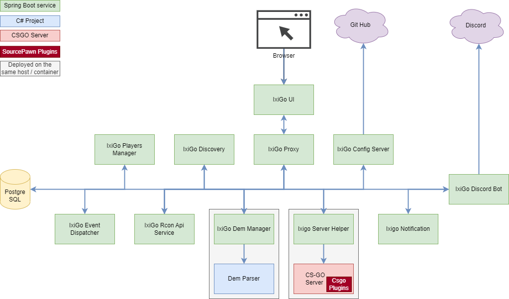

# IxiGo Util

This is a personal project that I made to simplify couple of things when playing with my friends at CSGO. We play on our CSGO [dedicated server](https://github.com/marcosolina/ixi_go) and I wanted an easier way to send RCON commands. I found [this nice library](https://github.com/Kronos666/rkon-core) which helps me to send the commands that I need. I decided then to create a simple REST API service and a simple PHP webpage to send RCON commands from the UI. In this way we just need to click on what I want to do :)

## Project Structure

- csgo_util
  - **AppsProperties**: This folder contains the properties used by the different services in the different environments. These properties are retrieved using the "Ixigo Config Server"
  - [CsgoPlugins](./CsgoPlugins/): This folder contains the source code of the CSGO plugins that we user
  - [DemParser](./DemParser/): This folders contains the C# project that we use to parse the ".dem" files and extract the games stats
  - [IxigoConfigServer](./IxigoConfigServer/): This is the Spring Boot configuration service that is used to serve the Services Properties for the different environmnets
  - [IxigoDemManager](./IxigoDemManager): This Spring Boot service manages the "dem" files created by the CSGO server. For example it will store new files, use the DemParse app to process these files, expose REST API to retrieve the info or the files itself
  - [IxigoDiscordBot](./IxigoDiscordBot/): This Spring Boot service is used to automate some taks while we play on our CSGO dedicated server. For example it will listen for either CSGO events or messages in the chat and then it can move the players to the appropriate channel, retrieve the Players statistic to balance the teams
  - **Misc**: Extra files used for documentation or the UI (CSGO Font, logo, Screenshots...)

## Requirements

- Java 11
- PHP >=5
- .NET Core
- PostgreSQL
- Spring Boot:
  - Config Server
  - Eureka Server
  - Zuul Server

## Register a CSGO Event Listener

The [CsgoRespApi](https://github.com/marcosolina/csgo_util/tree/main/CsgoRestApi) project exposes some [APIs](https://marco.selfip.net/zuul/csgo-rest-api/rcon/swagger-ui.html#/events) which allows you to register a CSGO event listener. One you have registered an event listener, that listener will receive a REST call every time one of the managed CSGO events is fired.

Supported events:

- **ROUND_END**: Triggered when the round ends (The warmup round does NOT trigger this event)
- **ROUND_START**: Triggered when a new round starts (The warmup round triggers this event)
- **CS_WIN_PANEL_MATCH**: Triggered when the match is over and the "Vote Screen" is displayed
- **WARMUP_START**: Triggered when the warmup starts
- **WARMUP_END**: This is calculated by the service, it will be fired when CSGO distpaches the first "ROUND_START" after the "WARMUP_START"

### Register an event listener

To register your event listener you have to perform an HTTP POST request to the service and provide:

- The name of the event that you want to register for
- The URL to call back when the specific event occurs.

**IMPORTANT**

- When the CSGO event is fired, your URL will receive an HTTP POST with a "content-type: application/json" and a JSON object in the body simlar to this one: "{"eventTime":"2021-05-01T19:35:32.178Z", "eventType": "ROUND_END" }"
- Your endpoint must reply with an OK HTTP Status Code (200)
- If your endpoint does not return 200 for more than three times in a row it will be "disabled". In this case you have to "un-register" and register it again

### **Examples**

**Register an event Listener**

Following is an example of registration of an event listener for the "CS_WIN_PANEL_MATCH" event

~~~~bash
curl --location --request POST 'https://marco.selfip.net/zuul/csgo-rest-api/rcon/event/register' \
--header 'Content-Type: application/json' \
--data-raw '{
    "url": "http://192.168.1.26:8080/demparser/events",
    "eventType": "CS_WIN_PANEL_MATCH"
}'
~~~~

**Event Dispatched**

Following is an example of a dispatched event from the service to your event listener

~~~~bash
curl --location --request POST 'http://192.168.1.26:8080/demparser/events' \
--header 'Content-Type: application/json' \
--data-raw '{
  "eventTime": "2021-05-01T19:35:32.178Z",
  "eventType": "CS_WIN_PANEL_MATCH"
}'
~~~~

## Misc

- [Run Chrome and allow CORS calls](https://stackoverflow.com/questions/3102819/disable-same-origin-policy-in-chrome)
