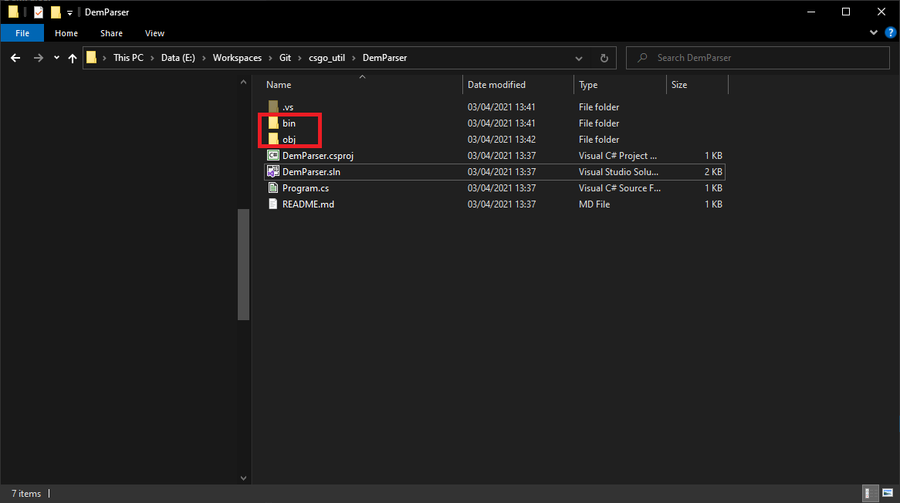

# Parse the DEM files locally

## Requirements

- [Visual Studio CE 2019](https://visualstudio.microsoft.com/vs/community/)
- [Eclipse](https://www.eclipse.org/downloads/packages/release/2021-03/r/eclipse-ide-enterprise-java-and-web-developers)
- [Eclipse Spring Tools](https://marketplace.eclipse.org/content/spring-tools-4-aka-spring-tool-suite-4)
- [PostgreSQL](https://www.postgresql.org/) or [Docker](https://www.docker.com/)

## Running Locally

**Info:** On my machine I run the DB in a Docker cointainer

- Copy the repository Link
  

- Use Eclipse to clone the repository
  

- Import the projects
  
  

- Try to work on a different branch and then once ready create a Pull Request to push the changes into the main branch
  

- Open the DemoParser.sln file with Visual Studio
 

- Compile the project
 

- Check for the new folders created by the compile process
 

### Build the Java Projects

- Install the Eclipse STS tool
 
 

- Compile the Maven Project
  
  
  

- Use the docker-compose file to start the Docker Container
  
  

- Use the Boot Dashboard to strat the "RoundParser" service
  

### Info

The application.yml file contains some properties that you can change when running it locally.

